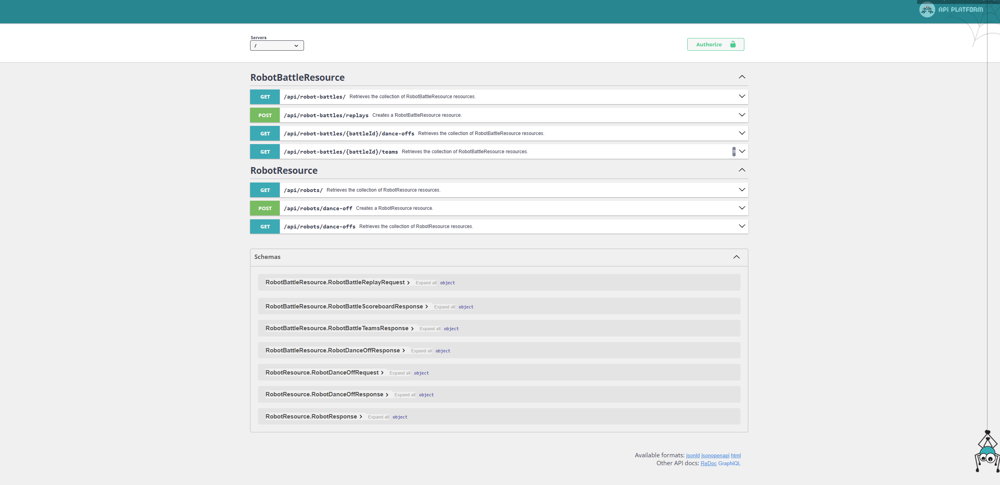
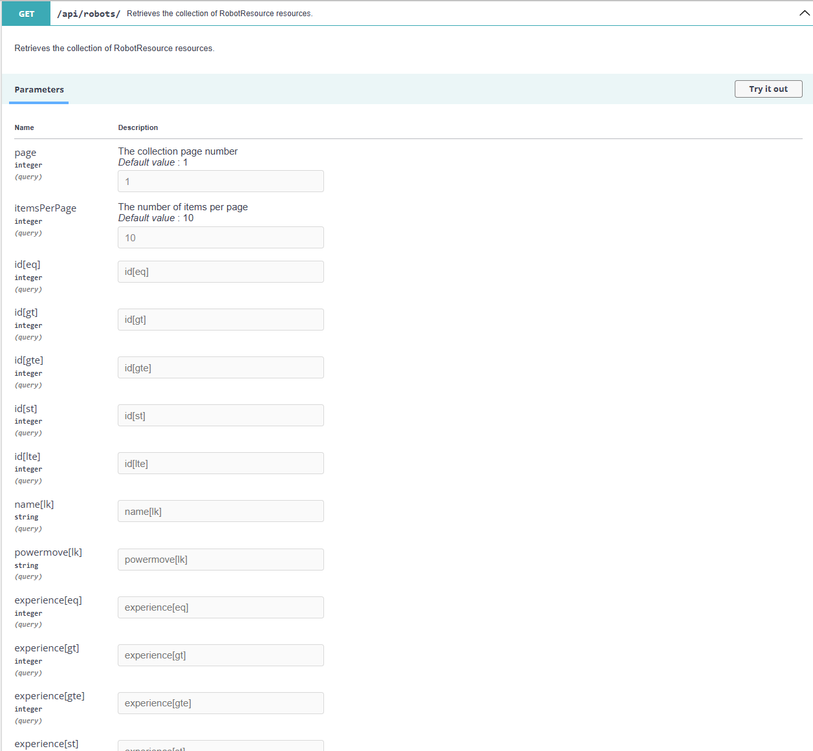
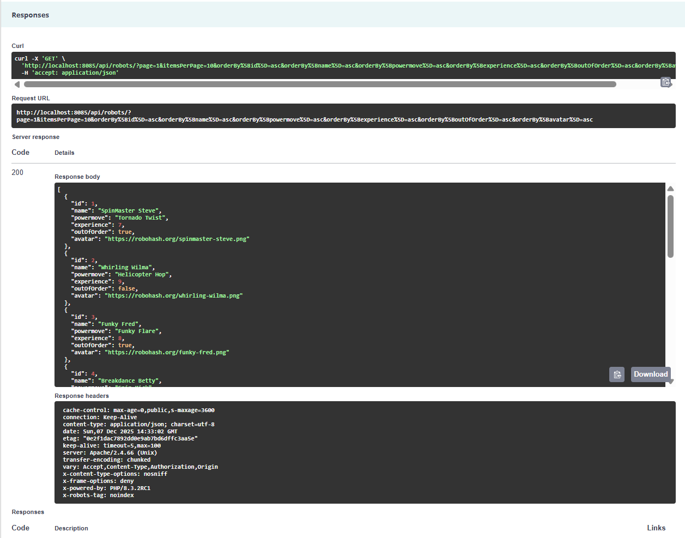

# ApiDomainer

ApiDomainer powers a robot battle league: send two lists of robot IDs, watch the platform assemble teams automatically, run a dance-off, and record the champion. The end result shows how to keep real-world business logic clean and testable while still shipping features quickly.

## ⚡ Core Highlights
- **Robot Dance-Off Engine** – POST two squads of robot IDs and the domain layer forms the teams, validates participants, runs the match-up, and persists the winner.
- **Clean CQRS Messaging** – Read/write concerns split across Symfony Messenger buses; queries return optimized payloads while commands orchestrate domain workflows.
- **View-Backed Read Models** – Doctrine maps read-only projections via attributes (`config/packages/doctrine.yaml`’s `AppView`) so we can hydrate DTO-like objects straight from SQL views.
- **API Platform Ready** – Resources, filters, and responders wire the domain to HTTP without leaking framework details into the core logic.
- **Developer-Friendly Separation** – Domain, Application, Infrastructure, and Action layers keep responsibilities sharp and testing approachable.

## 🚀 Quick Start
A friendly API for running a robot dance-off league: send two sets of robot IDs, the platform assembles the teams, runs the matchup, and tracks the winner. Perfect for showcasing clean API flows to newcomers or recruiters without diving into internals.

## What You Can Do
- Start a new dance-off between two squads of robots.
- Replay an existing battle with a couple of roster swaps.
- Browse all robots and their stats.
- Check a scoreboard of recent battles and winners.

## Key API Routes
- `POST /api/robots/dance-off` – Start a fresh battle with two lists of robot IDs.
- `POST /api/robot-battles/replays` – Replay a past battle with up to two swaps per side.
- `GET /api/robot-battles` – Scoreboard of battles and their latest results.
- `GET /api/robots` – Browse robots, filter, and sort.
- `GET /api/robots/{id}` – View a single robot.




## Run Locally
```bash
make build / make up
make build
make install
make up
```
Visit the 🌐 [API endpoint](http://localhost:8085/api)

## 🧭 Architecture at a Glance
- **Domain (pure business logic)**  
  Entities (`Robot`, `Team`, `RobotDanceOff`, `RobotDanceOffHistory`), value objects (`DanceOffTeams`, `BattleReplayInstruction`, `FilterCriteria`), and service rules (`RobotService`, `RobotValidatorService`).  
  Repository contracts live here in `src/Domain/Repository/*Interface.php`.
- **Infrastructure (repo implementations + transport)**  
  Doctrine-backed repository implementations live in `src/Infrastructure/Repository/*Repository.php` and satisfy the domain interfaces.  
  API Platform resources, filters, request models, normalizers, and HTTP handlers live here too.
- **Application (query use-cases)**  
  Query objects + handlers in `src/Application/Query` and `src/Application/Query/Handler` coordinate read workflows through the query bus.
- **Action / Responder (HTTP edge)**  
  Actions receive HTTP requests and dispatch use-cases; responders shape final API payloads.

### Folder Map
- `src/Domain` - Business rules + repository interfaces
- `src/Application` - Query DTOs, queries, handlers, request mapping
- `src/Infrastructure/Repository` - Doctrine repository implementations
- `src/Infrastructure/ApiResource` - API Platform route definitions
- `src/Infrastructure/Handler` - Messenger handlers for write operations
- `src/Action` and `src/Responder` - Controller/responder boundary

### Doctrine Repository Structure
- Domain defines the contracts (`*RepositoryInterface`) so business logic depends on abstractions, not Doctrine.
- Infrastructure implements those contracts with Doctrine classes (`*Repository`) and keeps ORM/query details isolated.
- `DoctrineReadRepository` is the query helper for read models: it applies `FilterCriteria` filters + operations (`eq`, `neq`, `gt`, `gte`, `lt`, `lte`, `lk`, `in`), applies sorts, and enforces pagination defaults/limits before execution.
- `DoctrineRepository` is the entity repository base: it centralizes persist/delete and batched persistence, and can still perform focused entity reads (for example `find(id)`-style lookups).
- In practice: read repositories are for rich, query-style retrieval; entity repositories may still read when needed to support domain workflows.
- This split keeps services easy to test and lets read/write repositories evolve independently without touching domain rules.

### Read Models & CQRS
- Write-side commands persist canonical aggregates (`RobotDanceOff`, `Team`, `Robot`).
- Read-side queries hydrate `RobotBattleView` objects from the `robot_battle_view` SQL view; Doctrine treats the view namespace (`App\\Domain\\ReadModel`) as attribute-mapped entities declared read-only.
- API Platform filters and orderers target these projections, keeping HTTP responses decoupled from the write models while still using Doctrine’s metadata and hydration pipeline.

## 🔬 Feature Flow: Creating a Dance-Off
1. **Request** – `POST /api/robots/dance-off` accepts a `RobotDanceOffRequest` with two arrays of robot IDs; the domain spins up a brand-new battle aggregate automatically.
2. **Handler** – `RobotDanceOffHandler` converts the request into the `DanceOffTeams` value object.
3. **Domain Service** – `RobotService` validates each robot, assembles two `Team` aggregates, runs the experience-based scoring algorithm, and persists the resulting `RobotDanceOff`.
4. **Persistence & Response** – Teams and dance-off entities are saved via Doctrine repositories. The responder layer presents a structured payload when queried.

### Replaying Battles
- `POST /api/robot-battles/replays` – Provide a `battleId` plus up to two robot swaps per side (`out` ➜ `in`) to run another dance-off using the same battle history. Example payload:
  ```json
  {
    "battleId": 3,
    "teamAReplacements": [{ "out": 12, "in": 34 }],
    "teamBReplacements": [{ "out": 21, "in": 55 }]
  }
  ```
- `GET /api/robot-battles/{battleId}/dance-offs` – Retrieve the full list of dance-offs for a given battle, including every roster permutation and winner.
- `GET /api/robot-battles/{battleId}/teams` – Return only the robot ID lists for each team across every dance-off in the battle; perfect for building replay lineups or roster views.
- `GET /api/robot-battles` – Quick scoreboard summarising each battle’s latest result and total number of replays so you can surface standings at a glance.

### Explore the League
- `GET /api/robots` – Browse all registered robots, filter by name, sort by experience, or inspect their stats individually.
- `GET /api/robots/dance-offs` – List dance-offs with search and ordering support, including the parent `battleId` so you can branch into replays.
- `GET /api/robots/{id}` – Fetch a single competitor and see if they are ready for the next matchup.

Each read endpoint rides the query bus for separation of concerns and returns serialized responses through dedicated responders.



## 🧱 Tech Stack
- PHP 8.2, Symfony Messenger, API Platform, Doctrine ORM
- Docker + Makefile for repeatable environments, Apache reverse proxy fronting the PHP-FPM container
- PHPUnit with lightweight stubs for fast feedback

## 🤝 Why It Matters
This project demonstrates how production-grade patterns (DDD, CQRS, ADR) can stay approachable. You can trace a feature end-to-end—from HTTP request through domain logic—without wading through framework noise.
Then visit http://localhost:8085/api
